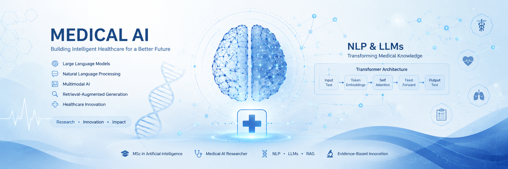

  

# Hi, I'm Neda Kheirkhah 👋

🎓 MSc Student in Artificial Intelligence

🔬 Researching Large Language Models (LLMs) for Healthcare

💡 Interested in:
- Medical AI
- Natural Language Processing (NLP)
- Large Language Models (LLMs)
- Retrieval-Augmented Generation (RAG)
- Multimodal AI

---

## About Me

I am an AI researcher focused on developing intelligent systems for healthcare. My current research explores medical large language models, multilingual NLP, and multimodal AI applications. I enjoy transforming research ideas into practical, open-source implementations.

## Featured Research

### 🩺 PerMed: Persian Medical Large Language Model

PerMed is my MSc research project, developed to extend the capabilities of Meditron by enabling high-quality Persian medical question answering and medical text translation.

The project focuses on:

- Persian adaptation of medical LLMs
- Medical question answering
- Medical text translation
- Prompt Engineering
- Multilingual Healthcare AI

**Current Status:** Research & Development

## Research Projects

### 🩺 PerMed
Persian Medical Large Language Model based on Meditron for multilingual medical question answering and medical text translation.

### 🧠 Medical RAG System
Retrieval-Augmented Generation system for answering medical questions using trusted medical knowledge sources.

### 🩻 Medical Multimodal AI
A multimodal AI project combining medical images and language models for intelligent healthcare applications.
